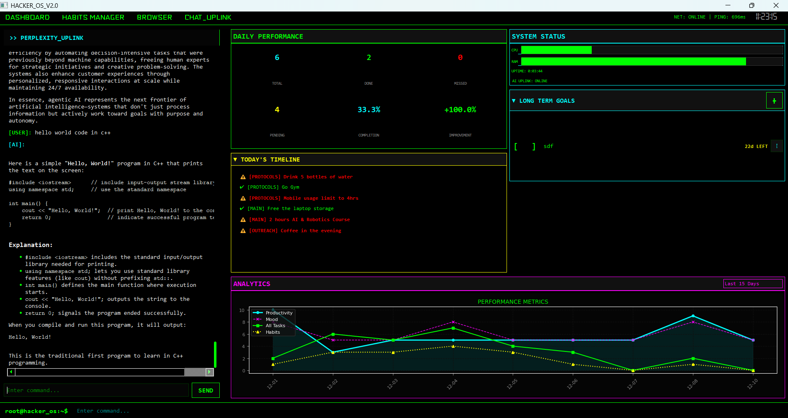
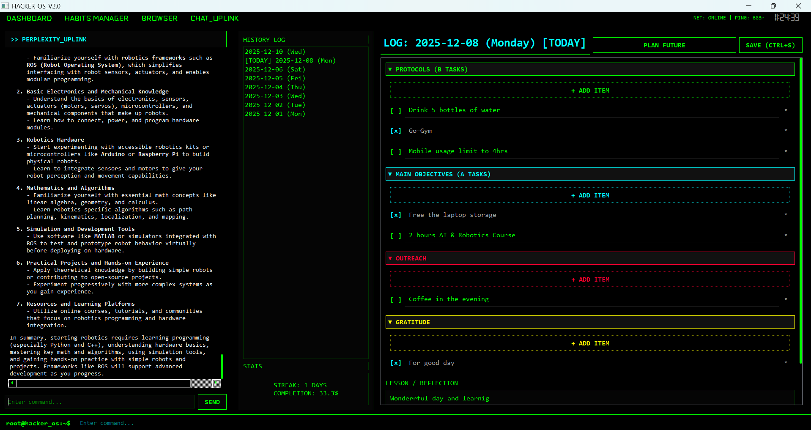
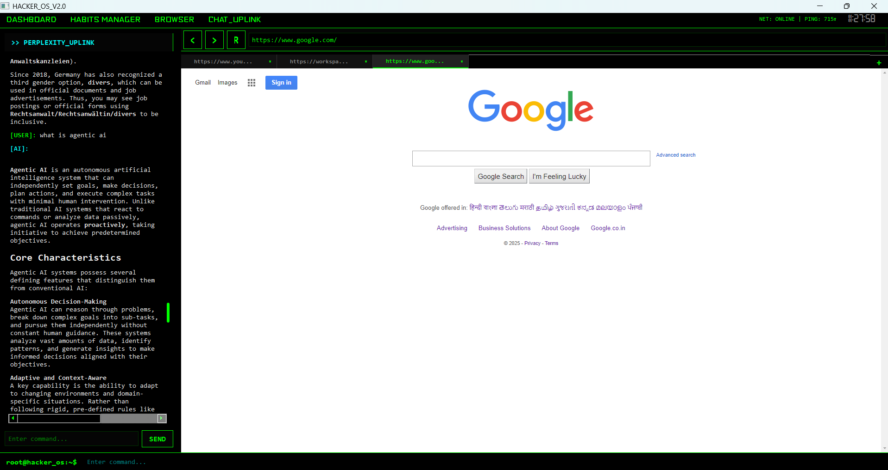

# 💀 HackerOS - High-Performance Productivity Suite

> *State-of-the-art cyberpunk productivity OS utilizing hybrid Python/C++ architecture.*



## 📡 Overview
HackerOS is a terminal-inspired productivity environment designed for high-efficiency workflows. It combines a robust **Task Management System**, **Habit Tracking Protocols**, and a **Long-Term Goal Strategizer** into a unified, responsive interface. Powered by **PyQt5** for the UI and **C++ (PyBind11)** for performance-critical operations, it features a built-in **AI Neural Link** (Perplexity API) for seamless intelligence augmentation.

## 📸 Interface Data
| **The Mainframe (Dashboard)** | **Protocol Enforcer (Habits)** | **Stealth Browser** |
|:---:|:---:|:---:|
|  |  |  |
| *Real-time analytics & monitoring* | *Interactive daily protocols* | *Integrated research terminal* |

## 🚀 Key Modules
- **📊 Analytics Engine**: Real-time trend analysis of productivity, mood, and habit consistency. Defaults to a 15-day sliding window.
- **🌐 Stealth Browser**: A custom, lightweight web interface integrated directly into the workspace for focused research without context switching.
- **🎯 Long Term Strategizer**: Scrollable, persistent goal tracking with visual progress indicators and deadline countdowns.
- **⚡ Quick Actions**: High-visibility controls for rapid data entry and task management.
- **🤖 Neural Link**: Integrated AI chatbot powered by the Perplexity API for instant research and assistance.
- **🛑 C++ Core**: Optimized backend modules for heavy lifting (matrix effects, data processing).

## 🔮 Future Enhancements
The roadmap includes advanced upgrades to the ecosystem:
- [ ] **Voice Command Interface**: Hands-free system control via specialized vocal directives.
- [ ] **Cloud Neural Sync**: Encrypted synchronization of habits and goals across multiple devices.
- [ ] **Advanced AI Personas**: Custom-trained AI assistants specializing in coding, writing, and strategy.
- [ ] **Gamification Expansion**: XP system and achievement unlocks for completing protocols and goals.

## 🛠️ Installation Protocol

### 1. Initialize Environment
```bash
# Clone the repository
git clone https://github.com/AanandPandit/out-of-box-habits.git
cd out-of-box-habits

# Create Virtual Environment
python -m venv venv

# Activate (Windows)
.\venv\Scripts\activate
# Activate (Linux/Mac)
source venv/bin/activate
```

### 2. Install Dependencies
```bash
pip install -r requirements.txt
```

### 3. Configure Security (.env)
Create a `.env` file in the root directory and add your Perplexity API key:
```ini
PERPLEXITY_API_KEY=pplx-xxxxxxxxxxxxxxxxxxxxxx
```

### 4. Build C++ Core (Optional)
*The system will auto-fallback to Python if C++ extensions are not built.*
```bash
mkdir build && cd build
cmake ..
cmake --build . --config Release
```

## 🎮 Execution
Launch the mainframe:
```bash
python main.py
```

## 📂 System Architecture
- `src/ui`: PyQt5 visual components & hacker stylesheets.
- `src/core`: Python logic, state management, and C++ bridge.
- `src/cxx`: C++ source files for performance optimization.
- `assets`: Binary assets, fonts, and imagery.

---
*System Status: ONLINE*
